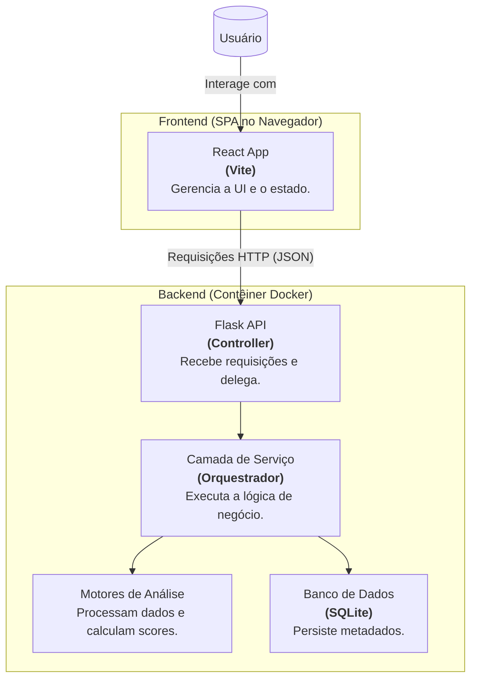
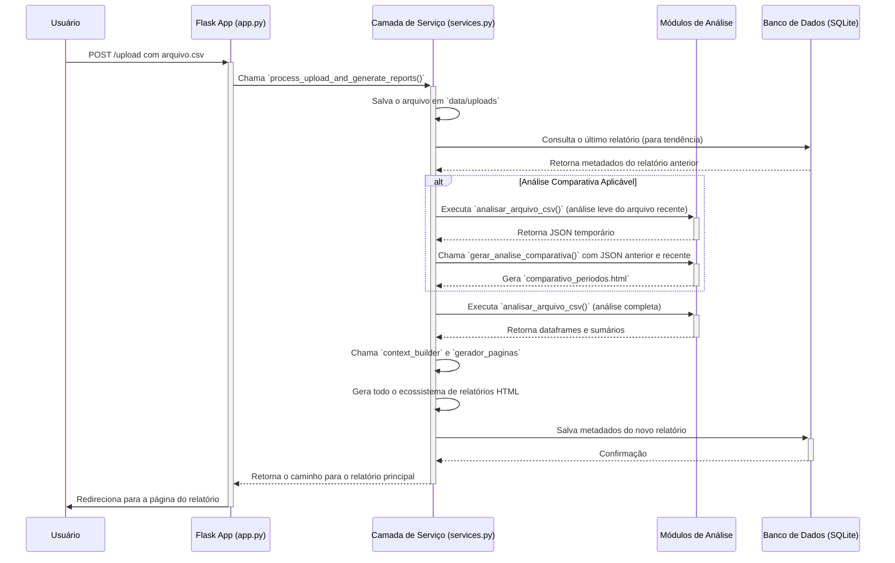

# 📐 Arquitetura do Sistema `meu-dash`

Este documento descreve a arquitetura desacoplada da aplicação, seus principais componentes e o fluxo de dados, conforme o plano de refatoração concluído.

## Visão Geral

A aplicação segue uma arquitetura moderna e desacoplada, composta por um **backend de API pura** e um **frontend Single-Page Application (SPA)**. Esta abordagem melhora a escalabilidade, a flexibilidade e a experiência de desenvolvimento.

- **Backend (API RESTful):** Uma aplicação **Flask** que expõe endpoints para manipulação de dados e acionamento de análises. Ele é responsável pela lógica de negócio, mas não renderiza nenhuma página da interface principal. Sua única responsabilidade é servir e receber dados no formato **JSON**.
- **Frontend (SPA):** Uma aplicação **React** (construída com Vite) que roda inteiramente no navegador do usuário. Ela consome a API do backend para buscar dados, enviar arquivos e apresentar a interface de forma rica e interativa.
- **Comunicação:** A comunicação entre frontend e backend ocorre exclusivamente via chamadas de API RESTful.

## Componentes Principais

O projeto está dividido em dois diretórios principais: `backend/` e `frontend/`.

#### Backend (`backend/src/`)

- `app.py`: Ponto de entrada da API Flask. Define os endpoints da API (ex: `/api/v1/dashboard-summary`), gerencia as requisições HTTP e delega toda a lógica para a camada de serviço.
- `services.py`: O cérebro da aplicação. Orquestra o fluxo de análise, interage com o banco de dados e coordena a chamada aos motores de análise e geradores de página.
- `analisar_alertas.py`: Motor de análise principal. Processa um arquivo `.csv`, agrupa alertas em Casos e calcula o score de prioridade para cada um.
- `analise_tendencia.py`: Motor de análise comparativa. Compara os resultados de dois períodos e gera o relatório de tendência.
- `gerador_paginas.py`: Responsável por usar os dados analisados para gerar os **artefatos** de relatório (arquivos HTML estáticos).

#### Frontend (`frontend/src/`)

- `main.tsx`: Ponto de entrada da aplicação React.
- `App.tsx`: Componente raiz que gerencia o roteamento e o layout principal.
- `components/`: Diretório contendo os componentes reutilizáveis da UI (ex: `Dashboard.tsx`, `UploadForms.tsx`).
- `services/api.ts`: Módulo responsável por fazer as chamadas à API do backend.

## Diagrama de Componentes

O diagrama abaixo ilustra a nova arquitetura desacoplada, mostrando a interação entre o usuário, o frontend e o backend.

## Fluxo de Dados (Upload de Arquivo Único)

O diagrama abaixo ilustra o fluxo de dados quando um usuário faz o upload de um novo arquivo para análise.

