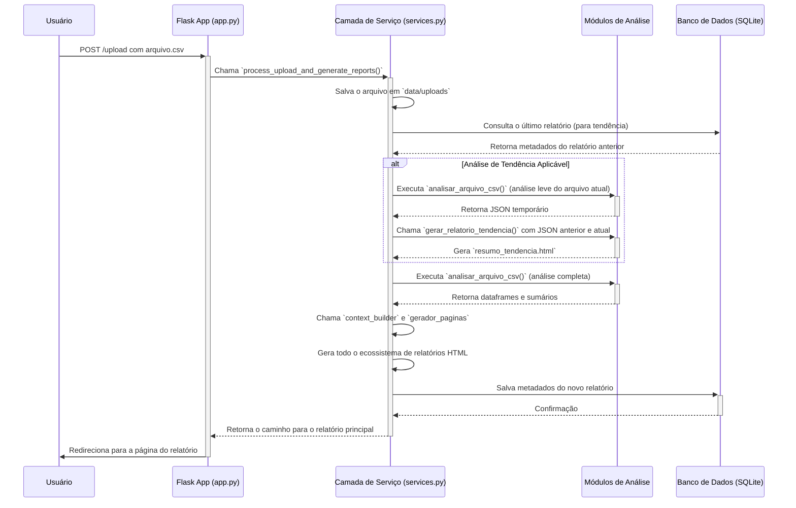

# 📐 Arquitetura do Sistema `meu-dash`

Este documento descreve a arquitetura da aplicação, seus principais componentes e o fluxo de dados, desde o upload de um arquivo pelo usuário até a geração dos relatórios.

## Visão Geral

A aplicação segue uma arquitetura de 3 camadas, executando sobre um framework web **Flask**:

1. **Camada de Apresentação (Flask Web)**: Responsável por renderizar a interface do usuário (HTML/CSS), receber requisições HTTP (como uploads de arquivos) e servir os relatórios gerados.
    - Componente principal: `src/app.py`
2. **Camada de Serviço**: Orquestra a lógica de negócio. Ela desacopla a camada web dos detalhes da análise de dados, recebendo os dados brutos da camada de apresentação e coordenando os módulos de análise e geração de páginas.
    - Componente principal: `src/services.py`
3. **Camada de Análise e Dados**: Contém os motores de análise que processam os dados dos arquivos `.csv`, aplicam a lógica de priorização e geram os dataframes e estatísticas.
    - Componentes principais: `src/analisar_alertas.py`, `src/analise_tendencia.py`

O sistema utiliza um banco de dados **SQLite** para persistir metadados sobre os relatórios gerados, permitindo a criação de um histórico e a funcionalidade de análise de tendência.

## Componentes Principais

- `src/app.py`: Ponto de entrada da aplicação Flask. Define as rotas (endpoints), gerencia as requisições e respostas HTTP e interage com a camada de serviço.
- `src/services.py`: O coração da lógica de negócio. Orquestra o salvamento de arquivos, chama os módulos de análise, gerencia o banco de dados e coordena a geração dos relatórios.
- `src/analisar_alertas.py`: Módulo que contém a lógica para analisar um único arquivo `.csv`. Ele lê o arquivo, o transforma em um dataframe do `pandas`, agrupa alertas em "Casos", calcula o Score de Prioridade e gera os dados base para os relatórios.
- `src/analise_tendencia.py`: Módulo responsável por comparar dois resultados de análise (um atual e um anterior) e gerar o relatório de tendência, destacando novos problemas, problemas resolvidos e a evolução geral.
- `src/context_builder.py`: Constrói o dicionário de contexto que é passado para os templates HTML, agregando todos os dados necessários para a renderização.
- `src/gerador_paginas.py`: Utiliza o contexto e os templates para gerar o ecossistema de arquivos HTML (dashboard principal, planos de ação, etc.).
- `data/`: Diretório persistido que armazena os arquivos de upload, os relatórios gerados e o banco de dados SQLite.
- `templates/`: Contém os templates Jinja2 para a renderização das páginas HTML.

## Fluxo de Dados (Upload de Arquivo Único)

O diagrama abaixo ilustra o fluxo de dados quando um usuário faz o upload de um novo arquivo para análise.

